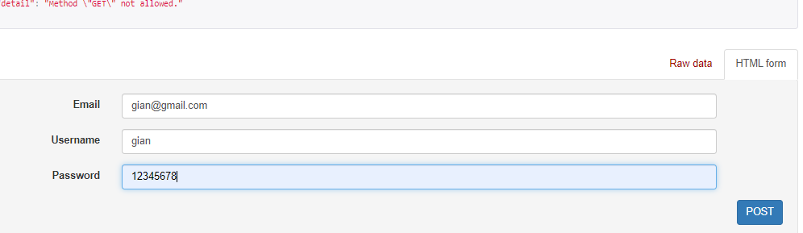
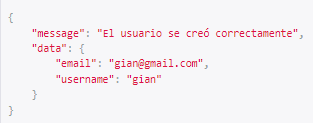
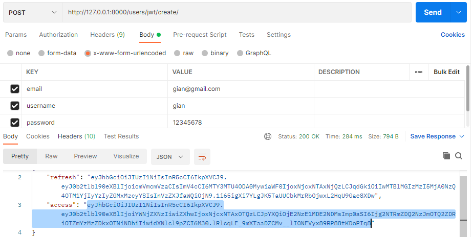
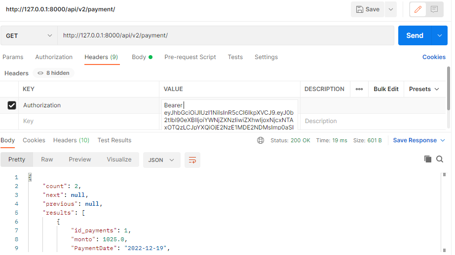

# Proyecto API - PAGOS

## Registro de cuenta
   http://127.0.0.1:8000/users/signup/
   

## Postman
## Creacion de token para poder usar la API
### Ingresar el email,username, password y copiar el token
   http://127.0.0.1:8000/users/jwt/create/
   

   
## En HEADERS

    En la columna KEY escribir Authorization y en VALUE escribir Bearer y poner el token para poder usar la api

## En este caso solo si el usuario esta autenticado podra listar todas las vistas y solo crear datos en la vista Payment
   http://127.0.0.1:8000/api/v2/payment/

## Si el usuario es admin tiene acceso a todo (CRUD)
      users: http://127.0.0.1:8000/api/v2/users/
      servicios: http://127.0.0.1:8000/api/v2/servicios/
      payment: http://127.0.0.1:8000/api/v2/payment/
      expired: http://127.0.0.1:8000/api/v2/expired/

## Versionamiento
    http://127.0.0.1:8000/api/v1/
    http://127.0.0.1:8000/api/v2/
